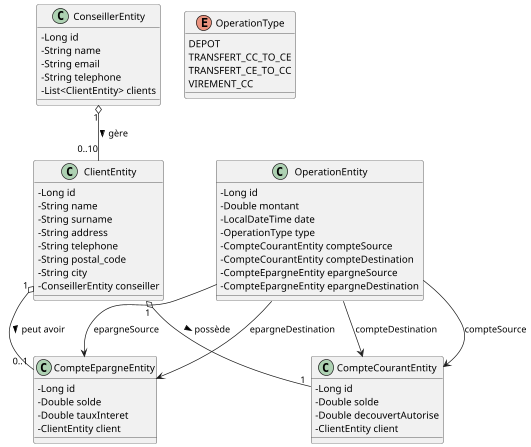
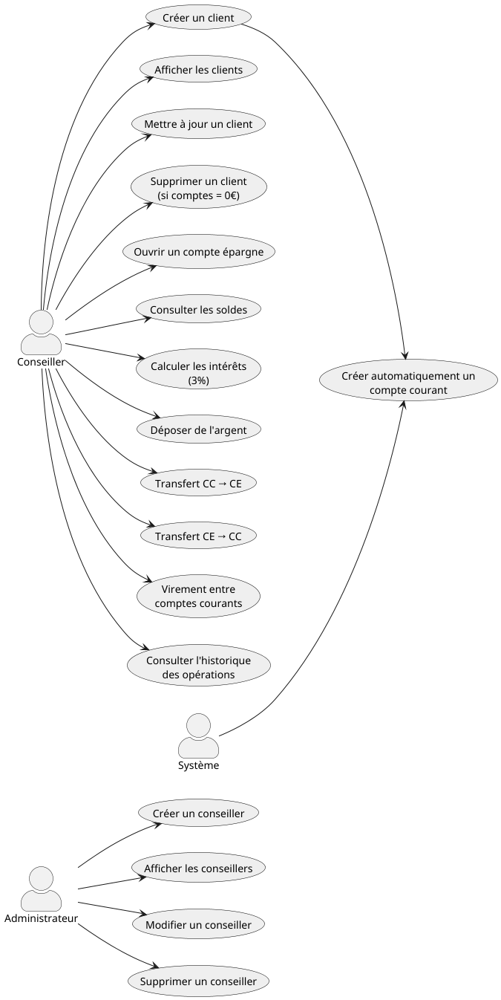

# SimpleCashSI — Application de Gestion Bancaire

SimpleCash est une application permettant la gestion simple et sécurisée des clients, conseillers, comptes bancaires et opérations financières.  
Elle fournit une API claire et organisée pour faciliter son intégration dans vos outils internes.

---

L’application permet à un conseiller bancaire de :

- gérer son portefeuille de clients,
- suivre les comptes (courant & épargne),
- effectuer des opérations bancaires,
- consulter l’historique des transactions.

L’objectif : rendre la gestion bancaire **intuitive**, **rapide** et **fiable**.

---

# Fonctionnalités principales

## 1. Gestion des Conseillers
- Création d’un conseiller  
- Consultation de tous les conseillers  
- Mise à jour d’un conseiller  
- Suppression (si non associé à des clients)

---

## 2. Gestion des Clients
- Création d’un client  
- Limitation : **un conseiller peut gérer jusqu’à 10 clients**  
- Modification des informations d’un client  
- Suppression (autorisé uniquement si les comptes = 0€)

Lorsqu’un client est créé :
- un **compte courant** est automatiquement généré,
- un **compte épargne** peut être ouvert sur demande.

---

##  3. Gestion des Comptes

### Compte Courant
- Consultation du solde  
- Modifications autorisées  
- Découvert possible jusqu’à **–1000 €**  

### Compte Épargne
- Gestion du solde  
- Application automatique du taux d’intérêt **3 %**

---

## 4. Opérations Bancaires

Toutes les opérations sont historisées.

- **Dépôt** sur un compte courant  
- **Transfert CC → CE**  
- **Transfert CE → CC**  
- **Virement** entre deux comptes courants  
  (même client ou clients différents)

---

# Architecture

L'application suit une architecture en couches :

- **Controller** : exposition API REST  
- **Service** : logique métier  
- **Repository** : accès aux données  
- **Entity** : représentation des objets persistés
- **DTO** : représentation des entités pour les échanges API

---

# Diagramme de Classes


# Diagramme de Cas d'Utilisation


---

# Lancer le projet

## 1. Cloner le dépôt
```bash
git clone <https://github.com/Fall-Fatou/Projet_Fall_Ndeye-Fatou.git>
cd simplecash
mvn spring-boot:run
```
L'application sera disponible sur : http://localhost:8080
## 2. Accéder à la documentation API
La documentation interactive Swagger est accessible à l'adresse suivante :
http://localhost:8080/swagger-ui/index.html#/

## 3. Axes d'amelioration futurs
- Simulation financière (prêts, découvert, épargne)
- Gestion de l'audit et des rapports
- Possibilité de modifier le conseiller d'un client